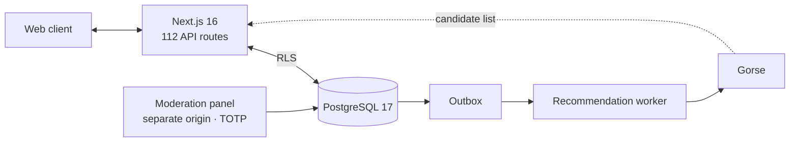

# Avizi

[Türkçe](README.md) · **English**

A social platform for Turkey's fishing community. Personalized feed, catch log, gear sets, fishing spot tracking and per-post location privacy.

**Showcase:** [lightwonkas.github.io/avizi-showcase](https://lightwonkas.github.io/avizi-showcase/)

<picture>
  <source media="(prefers-color-scheme: dark)" srcset="docs/preview-dark.png">
  
</picture>

> **Status:** In development, pre-closed beta. The application source code is in a private repository; this repository contains the showcase page only.

## Stack

| Layer | Components |
|---|---|
| Application | Next.js 16 · React 19 · TypeScript |
| Data | Supabase — PostgreSQL 17, Auth, Storage, Row Level Security |
| Recommendations | Gorse · outbox-driven sync worker |
| Moderation | Panel on a separate origin, mandatory TOTP |
| Compliance | Data export and account deletion under KVKK (Turkish data protection law) |
| Experimentation | A/B framework — sticky assignment, per-experiment kill switch |

## Architecture

The recommendation engine only proposes candidates; visibility is always decided in the database through RLS policies. Access control lives in a single layer that the recommendation service cannot bypass.

### Feed pipeline — v1.1.0

| Stage | Function |
|---|---|
| Candidate generation | Merges follows, reposts, trending, low-exposure content and Gorse |
| Eligibility | Every candidate passes visibility rules regardless of its source |
| Ranking | Scoring followed by diversity-aware reranking |
| Pagination | Stored slate with a signed cursor; no duplicates or drift between pages |
| Delivery | Delivery and exposure logging written in a single transaction |
| Impression | Qualified impression threshold: ≥ 50% visible for ≥ 1 s |

## Engineering

| Metric | Value |
|---|---|
| Database migrations | 146 |
| pgTAP SQL test files | 72 |
| Application test files | 212 |
| API routes | 112 |

- **UI principle:** no fake data and no fake success states; disabled features are shown as unavailable, with the reason.
- **Accessibility:** 44 px minimum touch targets, full keyboard support, light/dark themes, `prefers-reduced-motion`.

## Roadmap

1. Controlled staging environment
2. Legal document approval
3. Domain and email infrastructure
4. Observability
5. Load testing
6. Closed beta

## Team

| | |
|---|---|
| **Emin Özbayraktar** | Co-founder — Product & Technology |
| **Arda Burak Akalın** | Co-founder — Growth & Community |

## Contact

[emin.ozbayraktarr@gmail.com](mailto:emin.ozbayraktarr@gmail.com) · [LinkedIn](https://www.linkedin.com/in/emin-ozbayraktar) · [GitHub](https://github.com/lightwonkas)

---

© 2026 Avizi. All rights reserved.
