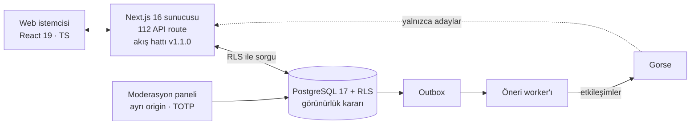

# Avizi — ürün ve mühendislik vitrini

Türkiye'deki balıkçılık topluluğu için sosyal platform. Kişisel akış, av günlüğü, ekipman setleri, mera takibi ve gönderi başına konum gizliliği.

**Canlı vitrin:** https://lightwonkas.github.io/avizi-showcase/

<picture>
  <source media="(prefers-color-scheme: dark)" srcset="docs/preview-dark.png">
  
</picture>

> Ürün geliştirme aşamasında, henüz yayında değil. Uygulamanın kaynak kodu özel bir depoda; bu depo yalnızca vitrin sayfasını içerir. Sayfadaki arayüz görüntüleri HTML/CSS ile çizilmiştir, kullanıcı adları ve içerik kurgusaldır.

---

## Rolüm

**Emin Özbayraktar** — kurucu ortak, ürün ve teknoloji. Yazılım, mimari, güvenlik, test ve sürüm süreçlerinden sorumluyum; teknik kararlarda son söz bende. Büyüme ve topluluk tarafını kurucu ortağım Arda yürütüyor.

## Teknoloji

| Katman | Seçim |
|---|---|
| Uygulama | Next.js 16, React 19, TypeScript |
| Veri | Supabase: PostgreSQL 17, Auth, Storage, satır düzeyi güvenlik (RLS) |
| Öneri | Gorse (yalnızca aday üretir), outbox tabanlı öneri worker'ı |
| Moderasyon | Ayrı origin'de panel, TOTP ile zorunlu iki adımlı doğrulama |
| Uyum | KVKK uyumlu veri dışa aktarma ve hesap silme akışları |
| Deney | A/B altyapısı: kalıcı (sticky) atama, deney başına kill switch |

## Mimari

Temel kural: **öneri motoru yalnızca aday önerir, görünürlüğe her zaman veritabanı karar verir.** Gorse'tan gelen bir aday da RLS kurallarından geçmeden kullanıcıya ulaşamaz; gizlilik hatası yapabilecek tek bir yer kalır.



### Akış hattı (feed algoritması v1.1.0)

1. **Aday üretimi** — takip, takip edilenlerin yeniden paylaşımları, trend, az görülen içerik ve Gorse.
2. **Uygunluk kontrolü** — her aday, kaynağından bağımsız olarak veritabanındaki görünürlük kurallarından geçer.
3. **Skor ve çeşitlilik** — skorlama, ardından çeşitlilik reranker'ı.
4. **Slate ve imzalı cursor** — sıralanmış sonuç saklanır; sayfalama bu slate'ten imzalı cursor ile okunur, sayfalar arasında tekrar ya da kayma olmaz.
5. **Teslimat ve exposure** — sayfa teslimi ve exposure kaydı tek transaction'da yazılır.
6. **Nitelikli gösterim** — bir kart yalnızca en az %50'si görünür halde en az 1 saniye kalırsa "görüldü" sayılır.

Vitrin sayfası 6. adımın kuralını tarayıcıda canlı çalıştıran küçük bir demo içerir (`IntersectionObserver`).

## Mühendislik

| | |
|---|---|
| Veritabanı migration'ı | **146** |
| pgTAP SQL test dosyası | **72** |
| Uygulama test dosyası | **212** |
| API route | **112** |
| Feed algoritması | **v1.1.0** |

- **Dürüst eylem ilkesi:** sahte veri yok, sahte başarı mesajı yok; çalışmayan bir özellik gizlenmez, kapalı görünür ve nedenini söyler.
- **Erişilebilirlik:** en az 44px dokunma alanı, tam klavye gezinmesi, açık/koyu tema, `prefers-reduced-motion` desteği.

## Durum

Geliştirme aşamasında. Mesajlaşma ve bildirim ekranları henüz arka uca bağlı değil. Sıradaki adımlar: kontrollü staging, yasal metinlerin onayı, alan adı ve e-posta altyapısı, gözlemlenebilirlik, kapasite testleri, ardından kapalı beta.

---

## In English

**Avizi** is a social platform for Turkey's fishing community: personalized feed, catch log, gear sets, fishing-spot tracking and per-post location privacy. I'm the co-founder responsible for product and technology.

- **Stack:** Next.js 16, React 19, TypeScript, Supabase (PostgreSQL 17, Auth, Storage, RLS), Gorse recommender with an outbox-driven worker.
- **Key design rule:** the recommender only proposes candidates; visibility is always decided by the database through RLS.
- **Feed pipeline:** multi-source candidates → eligibility check → scoring + diversity reranker → stored slate with signed cursor → delivery and exposure logging in one transaction → qualified impression (≥50% visible for ≥1 s).
- **Engineering:** 146 migrations, 72 pgTAP SQL test files, 212 application test files, 112 API routes; separate-origin moderation panel with mandatory TOTP; KVKK (Turkish GDPR) export/deletion flows; A/B framework with sticky assignment and kill switches.
- **Status:** in development, not yet launched. Source code is private; happy to walk through it in a technical interview.

## Bu depo

```
index.html     Tek dosyalık vitrin sayfası (CSS/JS satır içi, dış görsel yok)
docs/          README görselleri
```

Sayfa bağımlılıksızdır; Google Fonts dışında dış kaynak yüklemez. Açık/koyu tema sistem tercihini izler, sağ üstteki düğmeyle değiştirilebilir.

## İletişim

- E-posta: emin.ozbayraktarr@gmail.com
- LinkedIn: [in/emin-ozbayraktar](https://www.linkedin.com/in/emin-ozbayraktar)
- GitHub: [lightwonkas](https://github.com/lightwonkas)

© 2026 Avizi. Tüm hakları saklıdır.
