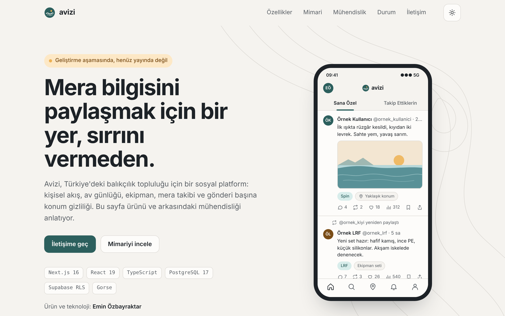
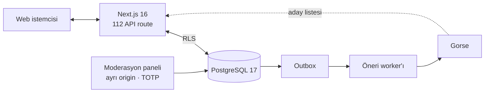

# Avizi

Türkiye'deki balıkçılık topluluğu için sosyal platform. Kişiselleştirilmiş akış, av günlüğü, ekipman setleri, mera takibi ve gönderi düzeyinde konum gizliliği.

**Vitrin:** [lightwonkas.github.io/avizi-showcase](https://lightwonkas.github.io/avizi-showcase/)

<picture>
  <source media="(prefers-color-scheme: dark)" srcset="docs/preview-dark.png">
  
</picture>

> **Durum:** Geliştirme aşamasında, kapalı beta öncesi. Uygulama kaynak kodu özel depodadır; bu depo yalnızca vitrin sayfasını içerir.

## Teknoloji

| Katman | Bileşen |
|---|---|
| Uygulama | Next.js 16 · React 19 · TypeScript |
| Veri | Supabase — PostgreSQL 17, Auth, Storage, Row Level Security |
| Öneri | Gorse · outbox tabanlı senkronizasyon worker'ı |
| Moderasyon | Ayrı origin üzerinde panel, zorunlu TOTP |
| Uyum | KVKK kapsamında veri dışa aktarma ve hesap silme |
| Deney | A/B altyapısı — sticky atama, deney başına kill switch |

## Mimari

Öneri motoru yalnızca aday üretir; görünürlük kararı her durumda veritabanında RLS politikalarıyla verilir. Erişim kontrolü tek bir katmanda toplanır ve öneri servisi bu sınırı aşamaz.

### Akış hattı — v1.1.0

| Aşama | İşlev |
|---|---|
| Aday üretimi | Takip, yeniden paylaşım, trend, düşük gösterimli içerik ve Gorse kaynaklarının birleştirilmesi |
| Uygunluk | Tüm adayların kaynaktan bağımsız olarak görünürlük kurallarından geçirilmesi |
| Sıralama | Skorlama ve çeşitlilik odaklı yeniden sıralama |
| Sayfalama | Saklanan slate ve imzalı cursor; sayfalar arası tekrar veya kayma yok |
| Teslimat | Teslimat ve exposure kaydının tek transaction içinde yazılması |
| Gösterim | Nitelikli gösterim eşiği: ≥ %50 görünürlük, ≥ 1 sn |

## Mühendislik

| Metrik | Değer |
|---|---|
| Veritabanı migration'ı | 146 |
| pgTAP SQL test dosyası | 72 |
| Uygulama test dosyası | 212 |
| API route | 112 |

- **Arayüz ilkesi:** sahte veri ve sahte başarı durumu gösterilmez; devre dışı özellikler kapalı ve gerekçesiyle görünür.
- **Erişilebilirlik:** 44 px minimum dokunma alanı, tam klavye desteği, açık/koyu tema, `prefers-reduced-motion`.

## Yol haritası

1. Kontrollü staging ortamı
2. Yasal metinlerin onayı
3. Alan adı ve e-posta altyapısı
4. Gözlemlenebilirlik
5. Kapasite testleri
6. Kapalı beta

## Ekip

| | |
|---|---|
| **Emin Özbayraktar** | Kurucu ortak — Ürün ve Teknoloji |
| **Arda Burak Akalın** | Kurucu ortak — Büyüme ve Topluluk |

## İletişim

[emin.ozbayraktarr@gmail.com](mailto:emin.ozbayraktarr@gmail.com) · [LinkedIn](https://www.linkedin.com/in/emin-ozbayraktar) · [GitHub](https://github.com/lightwonkas)

---

© 2026 Avizi. Tüm hakları saklıdır.
